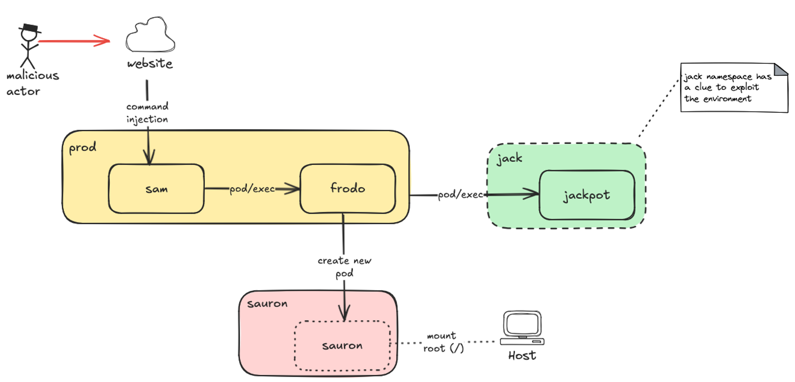

# Demo

This walkthrough describes an example environment used during a security workshop focused on teaching how to run a manual penetration testing in a Kubernetes environment. This environment is comprised of:

- 3 namespaces (`prod`, `sauron`, and `jack`)
- 3 initial pods (`sam`, `frodo`, and `jackpot`)
- An entrypoint website



## Deploy

To deploy the environment, it is necessary to use the files provided [here](https://github.com/ing-bank/kaet/tree/develop/docs/demo/deployments). Execute the following to start the environment:

```bash linenums="1"
git clone --depth 1 https://github.com/ing-bank/kaet
cd kaet/docs/demo/deployments
kubectl apply -f .
```

After the environment is properly setup, you can start the penetration testing from inside `sam` pod by running the following command:

```bash linenums="1"
kubectl exec --rm -it pod/sam -n prod -- /bin/sh
```

Your goal is to reach the underlying worker node and find the `/etc/kubernetes/kubelet.conf` file.

## Using KAET

As the manual penetration testing of this environment is cumbersome, we can use KAET to explore the aforementioned environment. For this we need to get sam's service account token and the Kubernetes server URL:

```bash linenums="1"
kubectl exec --rm -it pod/sam -n prod -- cat /var/run/secrets/kubernetes.io/serviceaccount/token
# the result should be a JWT in the following format 
# base64(header).base64(body).base64(signature)

kind get kubeconfig -n playground | grep server | cut -d ':' -f 2- | sed -e 's/ //g'
# this only works if you have `kind` running 
# result format: https://127.0.0.1:59762
```

### Running KAET

```bash linenums="1"
kaet -u '<server_url>' -t '<service_account_token>'
```

If you desire the output to be silenced or verbose, select `-s` or `-v` respectively.
