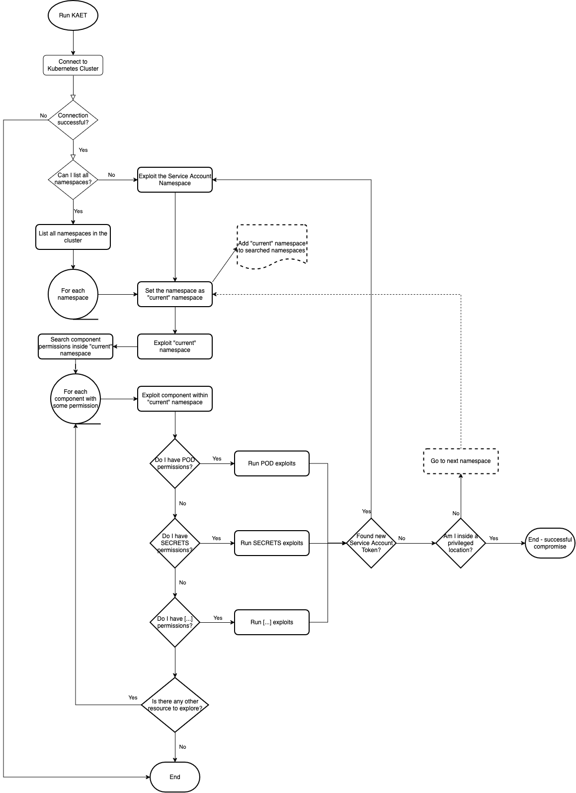

# How does KAET work?

## Project Structure

```bash
.
├── cmd
│   └── kaet
├── internal
│   └── infratools
└── pkg
    ├── clouds
    │   ├── aws
    │   ├── azure
    │   ├── gcp
    │   ├── kubernetes
    │   │   ├── exploits
    │   │   └── utils
    │   └── openshift
    ├── kaet
    │   ├── discovery
    │   ├── enumerate
    │   ├── exploit
    │   ├── explore
    │   └── identify
    ├── runner
    └── types
```

- `cmd`: contains CLI options and commands
- `internal`: contains all functionality that is internal to KAET
  - `internal/infratools`: contain KAETs memory, a heap data structure used to save information about the current state of execution
- `pkg`: contains all functionality used in KAET that can be used as a package
  - `pkg/clouds`: contains packages related to cloud providers as Azure, Google Cloud, AWS, Vanilla Kubernetes, and so on
    - `pkg/clouds/azure`: contains all functionality to interact with Azure Cloud
    - `pkg/clouds/gcp`: contains all functionality to interact with Google Cloud Provider (GCP)
    - `pkg/clouds/aws`: contains all functionality to interact with Amazon Web Services (AWS)
    - `pkg/clouds/kubernetes`: contains all functionality to interact with a Kubernetes cluster
      - `pkg/clouds/kubernetes/exploits`: contains all logic on how to exploit a Kubernetes Cluster
      - `pkg/clouds/kubernetes/exploits`: contains utility functions to help interact with a Kubernetes Cluster and run exploits
    - `pkg/clouds/openshift`: contains all functionality specific to interact with Open Shift Clusters
  - `pkg/kaet`: contains modules used while running KAET. Each module is an abstraction of processes
    - `pkg/kaet/discovery`: module with logic used to discover resources to be enumerated and exploited
    - `pkg/kaet/enumerate`: module that enumerates resources searching for permissions, secrets, and more
    - `pkg/kaet/exploit`: module used to exploit a resource independently of cloud provider
    - `pkg/kaet/explore`: module used to explore a Kubernetes Cluster and Cloud provider
    - `pkg/kaet/identify`: module used to identify where KAET is executing and the target
  - `pkg/runner`: package containing all logic to execute KAET, how each module is used and the main flow process
  - `pkg/types`: package that exports general types used in the code base

## Execution Flow



<!-- ## Inner Dependency Graph -->