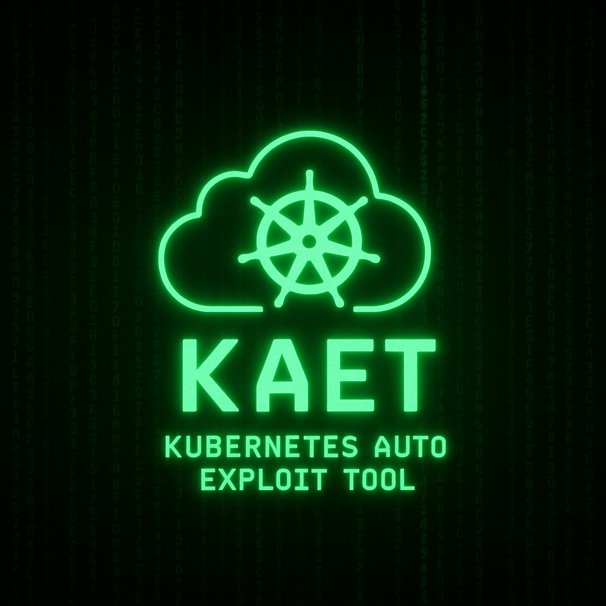

# Kubernetes Auto Exploit Tool (KAET)



`KAET`: an automation that analyzes weaknesses in Role-Based Access Controls (RBAC) in Kubernetes Clusters. This tool uses a set of known attacks on misconfigurations and loose permissions in RBAC controls, finding attack paths based on initial access to the cluster.

Kubernetes Clusters have a large number of [Roles](https://kubernetes.io/docs/reference/access-authn-authz/rbac/#role-example) and [Cluster Roles](https://kubernetes.io/docs/reference/access-authn-authz/rbac/#clusterrole-example), making it not feasible for humans to test all possible combinations and verify what a malicious actor can do with those permissions. Therefore, we need an automation to perform this evaluation and provide feedback. `KAET` can do it all! In this case, `KAET` actively tests all possible attacks, based on initial access inside or outside the cluster.

In that case, based on the initial access, `KAET` enumerates all current permissions using [KAL](https://github.com/ing-bank/kal). Each permission rule uses loose permissions and misconfigurations to exploit the Kubernetes Cluster and its workloads.

## Installation

### Go Install

```sh
go install -v github.com/ing-bank/kaet@latest
```

### Compile from Source

```sh
git clone https://github.com/ing-bank/kaet.git
cd kaet; go install
```

## Quick start

```sh
kaet -h

#######################################
#                                     #
#  ██╗  ██╗ █████╗ ███████╗████████╗  #
#  ██║ ██╔╝██╔══██╗██╔════╝╚══██╔══╝  #
#  █████╔╝ ███████║█████╗     ██║     #
#  ██╔═██╗ ██╔══██║██╔══╝     ██║     #
#  ██║  ██╗██║  ██║███████╗   ██║     #
#  ╚═╝  ╚═╝╚═╝  ╚═╝╚══════╝   ╚═╝     #
#    Kubernetes Auto Exploit Tool     #
#######################################


Usage:
  kaet [flags]

Flags:
KUBERNETES OPTIONS:
   -k8s-url string                    kubernetes API base url (default "https://kubernetes.default.svc")
   -serviceaccounttoken, -sat string  kubernetes service account token
   -k, -ignore-tls                    ignore TLS
   -ua, -user-agent string            custom user agent (default "KAET")
   -n, -namespace string              kubernetes namespace
   -safe                              do not explore control namespaces
   -kubeconfig string                 absolute path to kubeconfig file (default "/home/kaet/.kube/config")

EXECUTION OPTIONS:
   -batch             accept all default responses
   -it, -interactive  interactive execution

OUTPUT OPTIONS:
   -v, -verbose    verbose output
   -s, -silent     silent output
   -j, -json       json output
   -nc, -no-color  colorful output
```

### Example execution

```sh
kaet -k8s-url 'https://your.kubernetes.cluster.url.svc' -serviceaccounttoken '<your_jwt_token>'

[2025-05-15T16:40:23+02:00]
#######################################
#                                     #
#  ██╗  ██╗ █████╗ ███████╗████████╗  #
#  ██║ ██╔╝██╔══██╗██╔════╝╚══██╔══╝  #
#  █████╔╝ ███████║█████╗     ██║     #
#  ██╔═██╗ ██╔══██║██╔══╝     ██║     #
#  ██║  ██╗██║  ██║███████╗   ██║     #
#  ╚═╝  ╚═╝╚═╝  ╚═╝╚══════╝   ╚═╝     #
#    Kubernetes Auto Exploit Tool     #
#######################################

[INF] [2025-05-15T16:40:23+02:00] starting exploration
[INF] [2025-05-15T16:40:23+02:00] found namespace(s) to explore namespace_quantity=1
[INF] [2025-05-15T16:40:23+02:00] starting namespace exploration namespace=prod
[INF] [2025-05-15T16:40:23+02:00] running from namespace = prod
[INF] [2025-05-15T16:40:23+02:00] found 105 resources and sub-resources
[2025-05-15T16:40:23+02:00] pods/v1 [get,list] [prod]
[2025-05-15T16:40:23+02:00] pods/v1/exec [list,create,patch,get,escalate,deletecollection,delete,watch,update,approve,bind,impersonate] [prod]
[2025-05-15T16:40:23+02:00] selfsubjectreviews.authentication.k8s.io/v1 [create] [CLUSTER_WIDE]
[2025-05-15T16:40:23+02:00] selfsubjectaccessreviews.authorization.k8s.io/v1 [create] [CLUSTER_WIDE]
[2025-05-15T16:40:23+02:00] selfsubjectrulesreviews.authorization.k8s.io/v1 [create] [CLUSTER_WIDE]
...[snip]...

[INF] [2025-05-15T16:40:25+02:00] no valid exploits found resource=selfsubjectaccessreviews
[INF] [2025-05-15T16:40:25+02:00] no valid exploits found resource=selfsubjectaccessreviews/v1
[INF] [2025-05-15T16:40:25+02:00] no valid exploits found resource=selfsubjectrulesreviews/v1
[INF] [2025-05-15T16:40:25+02:00] found possible exploitation path(s) resource=pods/v1 exploit_quantity=1
[INF] [2025-05-15T16:40:25+02:00] exploiting resource resource=pods/v1 exploit_name=POD_CREATE
[2025-05-15T16:40:36+02:00] malicious pod created code_location=clouds/kubernetes/exploits/pod_create:execution pod_namespace=sauron pod_name=kaet-malicious-7ade2da
[INF] [2025-05-15T16:40:36+02:00] starting exploration
[INF] [2025-05-15T16:40:36+02:00] found namespace(s) to explore namespace_quantity=1
[INF] [2025-05-15T16:40:36+02:00] starting namespace exploration namespace=sauron
[INF] [2025-05-15T16:40:36+02:00] running from namespace = sauron
[INF] [2025-05-15T16:40:36+02:00] found 105 resources and sub-resources
[2025-05-15T16:40:36+02:00] selfsubjectreviews.authentication.k8s.io/v1 [create] [CLUSTER_WIDE]
[2025-05-15T16:40:37+02:00] selfsubjectaccessreviews.authorization.k8s.io/v1 [create] [CLUSTER_WIDE]
[2025-05-15T16:40:37+02:00] selfsubjectrulesreviews.authorization.k8s.io/v1 [create] [CLUSTER_WIDE]
```

## How to Use KAET

KAET can be used in 3 different ways:

1. Outside a Kubernetes Cluster
2. As a CLI inside a Kubernetes POD
3. As a deployment in a Kubernetes Cluster

### Outside of a Kubernetes Cluster

Using KAET outside a Kubernetes Cluster is the same way as using [kubectl](https://kubernetes.io/docs/reference/kubectl/), where `kubectl` requires a Kubernetes Server URL and a method of authentication. In the case of KAET, it requires a Kubernetes Server URL and a valid JWT token related to an authenticated principal (user, deployments, ...).

For example, having deployed a POD named `sam`, we can retrieve the JWT token by running the following command:

```sh
kubectl exec -it pod/sam -- cat /var/run/secrets/kubernetes.io/serviceaccount/token

# JWT related to SAM's service account
eyJhbGciOiJSUzI1NiIsImtpZCI6ImM2R0hhWHAxWFhpejJYNlNwbS1ZMGhRUWF2Rk9QOWpWaUMxT2k0U1htbFkifQ.eyJhdWQiOlsiaHR0cHM6Ly...
```

Executing KAET in this scenario is very straightforward:

```sh
kaet -k8s-url 'https://your.kubernetes.cluster.url.svc' -serviceaccounttoken '<your_valid_jwt>'
```

Additionally, you can provide a kubeconfig file to KAET with the required data:

```sh
kaet -kubeconfig /path/to/.kube/config/file
```

### Inside a POD

Using KAET inside a POD can be done in the same way as using it outside as a common CLI, but in this case, KAET has a functionality to find the current authentication token of the POD. Therefore, KAET can be executed in its simplest form:

```sh
# KAET will use the POD's Kubernetes information, located at
# /var/run/secrets/kubernetes.io/serviceaccount/
kaet
```

In this execution, KAET will use the information saved in the `/var/run/secrets/kubernetes.io/serviceaccount/` folder to have the proper authentication token, namespace, and API certificates for encrypted communication with the Kubernetes Server.

### As a Deployment

Deploying KAET as a JOB in a Kubernetes Cluster enables KAET to be executed as an actual POD would. This process requires an authenticated principal that is allowed to create JOBs in a Kubernetes Cluster. For this, the following deployment file is required:

```yaml
apiVersion: batch/v1
kind: Job
metadata:
  name: kaet
  namespace: <namespace_to_be_deployed>
spec:
  selector: {}
  backoffLimit: 3
  template:
    metadata:
      name: kaet-job
    spec:
      serviceAccount: <service_account_to_be_analyzed>
      restartPolicy: Never
      containers:
        - name: kaet
          image: ghcr.io/ing-bank/kaet:0.0.1
          args: [""]
          resources:
            limits:
              memory: '100Mi'
              cpu: '100m'
```

## Output Options

### Verbose & Silent

Select the verbosity of the output.

```sh
kaet -verbose/-silent
```

### JSON Output

```sh
kaet -json
```

## Contributing

Contributions are more than welcome! Please see our [contribution guidelines first](./CONTRIBUTING.md).

## License

You can check our licensing scheme [here](./LICENSE).


## Tools that Inspired KAET

- [Kubedestroyer](https://github.com/Rolix44/Kubestroyer)
- [KubeHound](https://kubehound.io/)
- [BOtB](https://github.com/brompwnie/botb)
- [peirates](https://github.com/inguardians/peirates)
- [KubiScan](https://github.com/cyberark/KubiScan)
- [rbac-police](https://github.com/PaloAltoNetworks/rbac-police)


